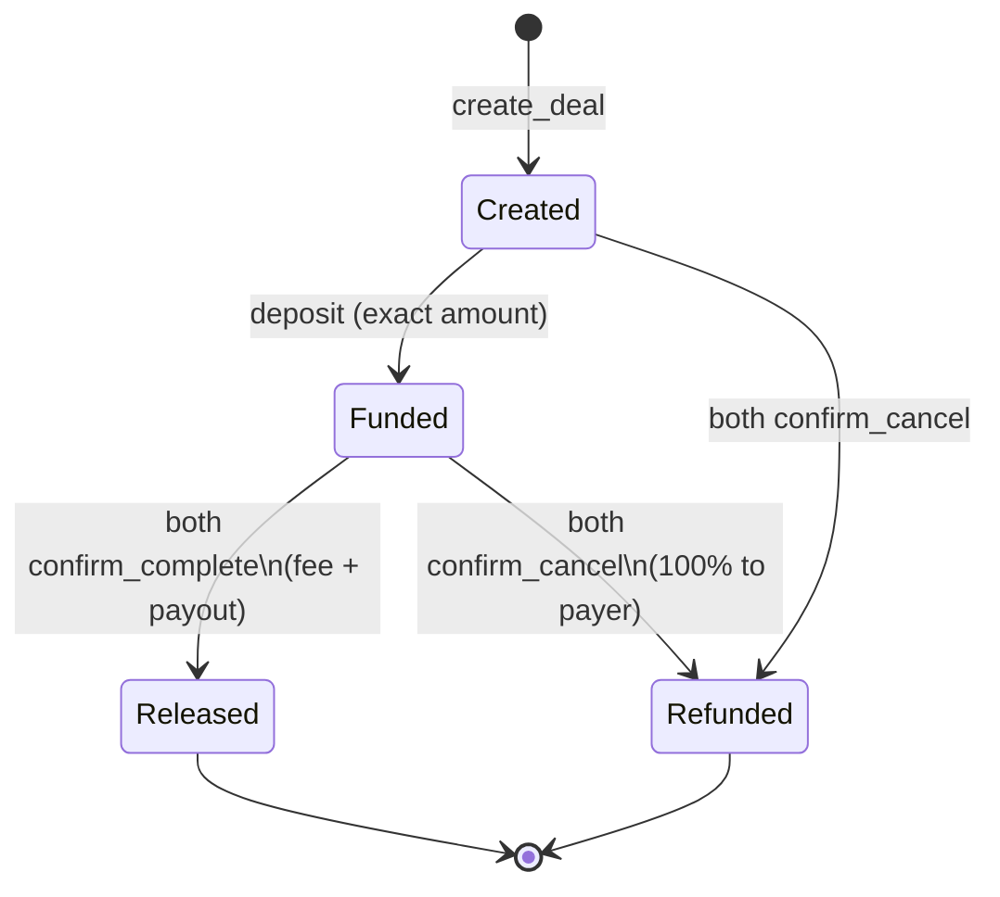

# Contractor

Non-custodial, anonymous **native SOL escrow** on Solana (Anchor).

Payer deposits SOL into a deal PDA. Funds **release** only when **both** parties confirm complete (protocol fee applies). **Mutual cancel** refunds the payer **100%** (no fee). No KYC. No admin / pause / upgrade / emergency withdraw.

## State machine



## Quickstart

```bash
# Program
anchor build
anchor test

# Frontend (static / IPFS-ready)
cd app
cp .env.example .env
npm install
npm run dev      # or: npm run build
```

Program id (dev keypair in repo deploy path): `DPcFT7E8GWzzgUfzP3M1VgBnipr8eR5Y4yv5f28wRt7k`

## Repo layout

| Path | Purpose |
|------|---------|
| `programs/contractor/` | Anchor program |
| `tests/` | Integration tests |
| `app/` | SvelteKit + wallet UI (`adapter-static`) |
| `docs/` | Architecture, deploy/IPFS, marketing, legal-risk |

## Instructions

1. `initialize(fee_bps, fee_recipient)` — once; `1..=1000` bps; **no update ix**
2. `create_deal(deal_id, payee, amount, terms_hash)` — signer = payer = creator
3. `deposit` — exact amount; Created → Funded
4. `confirm_complete` — both → release (`fee = amount * fee_bps / 10_000`)
5. `confirm_cancel` — both Funded → full refund; both Created → close

Default fee **250 bps (2.5%)**, max **1000 bps**. Fee **only** on successful release.

## Security model

- Deal PDA holds lamports; dual confirmation required for release
- Config fee immutable after `initialize`
- Documented deploy: `solana program set-upgrade-authority … --final`, discard deployer key
- Exact deposit amount; status gates prevent double release

See [docs/ARCHITECTURE.md](docs/ARCHITECTURE.md).

## Legal disclaimer

This software is provided **as-is** with **no warranty**. It is **not** legal, tax, or financial advice. Non-custodial design does **not** eliminate regulatory risk for operators or users. Read [docs/LEGAL-RISK.md](docs/LEGAL-RISK.md) and consult counsel before mainnet use.

## Next steps

- [ ] Independent security audit
- [ ] Mainnet deploy + `--final` upgrade authority
- [ ] Multisig fee recipient
- [ ] Pin frontend to IPFS / SNS
- [ ] Optional: SPL token support, timeouts (explicit v1 non-goals today)

## License

MIT (or as otherwise stated in `LICENSE` when added).
