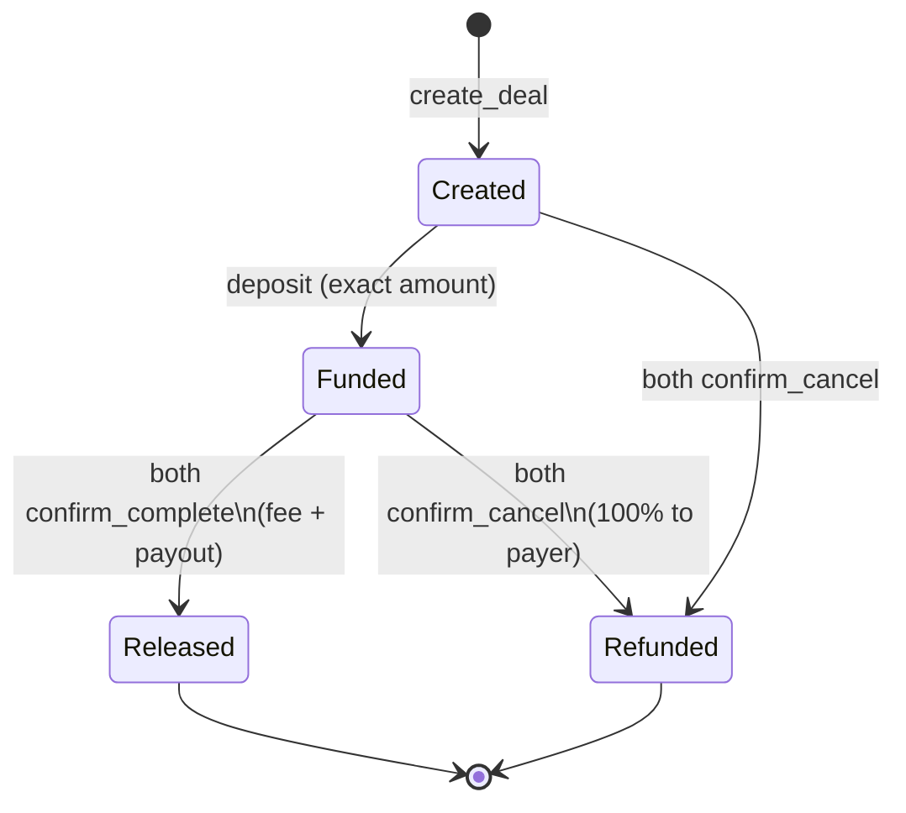

# Contractor

Non-custodial, anonymous **native SOL escrow** on Solana (Anchor 0.30.1).

Payer deposits SOL into a deal PDA. Funds **release** only when **both** parties confirm complete (protocol fee applies). **Mutual cancel** refunds the payer **100%** (no fee). No KYC. No admin / pause / upgrade / emergency withdraw.

## Build status (box-verified)

| Check | Status |
|-------|--------|
| `anchor build --no-idl` | ✅ SBF `.so` builds (platform-tools **v1.48** / rustc 1.84; see [docs/BUILD-NOTES.md](docs/BUILD-NOTES.md)) |
| IDL via `anchor build` | ⚠️ Host rustc 1.98 vs `anchor-syn` 0.30.1 — use committed [idl/contractor.json](idl/contractor.json) + `anchor idl type` |
| `anchor test --skip-build` | ✅ **14 passing** |
| `cd app && npm run build` | ✅ static `adapter-static` → `app/build/` |

Program id (dev keypair): `DPcFT7E8GWzzgUfzP3M1VgBnipr8eR5Y4yv5f28wRt7k`

## State machine



## Quickstart

```bash
# Program (see docs/BUILD-NOTES.md for toolchain pins)
anchor build --no-idl
cp idl/contractor.json target/idl/contractor.json
mkdir -p target/types
anchor idl type target/idl/contractor.json -o target/types/contractor.ts
anchor test --skip-build

# Frontend (static / IPFS-ready)
cd app
cp .env.example .env
npm install
npm run build   # or: npm run dev
```

## Repo layout

| Path | Purpose |
|------|---------|
| `programs/contractor/` | Anchor program |
| `tests/` | Integration tests |
| `app/` | SvelteKit + wallet UI (`adapter-static`) |
| `idl/` | Checked-in IDL (workaround for host IDL codegen) |
| `scripts/` | Initialize config, `--final` upgrade authority, launch checklist |
| `docs/` | Architecture, deploy/IPFS, **marketing**, legal-risk |
| `docs/marketing/` | Social thread + launch checklist |

## Instructions

1. `initialize(fee_bps, fee_recipient)` — once; `1..=1000` bps; **no update ix**
2. `create_deal(deal_id, payee, amount, terms_hash)` — signer = payer = creator
3. `deposit` — exact amount; Created → Funded
4. `confirm_complete` — both → release (`fee = amount * fee_bps / 10_000`)
5. `confirm_cancel` — both Funded → full refund; both Created → close

Default fee **600 bps (6%)**, max **1000 bps**. Fee **only** on successful release.

## Security model

- Deal PDA holds lamports; dual confirmation required for release
- Config fee immutable after `initialize`
- Documented deploy: `solana program set-upgrade-authority … --final`, discard deployer key
- Exact deposit amount; status gates prevent double release

See [docs/ARCHITECTURE.md](docs/ARCHITECTURE.md) and [docs/DEPLOY.md](docs/DEPLOY.md).

## Marketing & legal

- Go-to-market copy, landing blocks, social drafts: [docs/MARKETING.md](docs/MARKETING.md)
- Launch sequence: [docs/marketing/launch-checklist.md](docs/marketing/launch-checklist.md)
- Honest risk notes (not legal advice): [docs/LEGAL-RISK.md](docs/LEGAL-RISK.md)

## What’s next for launch

1. Independent **security audit** + fix findings  
2. **Counsel** before collecting mainnet fees  
3. Fee recipient → published **multisig**  
4. Devnet demo → mainnet deploy + `--final`  
5. Pin UI to **IPFS** / optional SNS  
6. Optional later: SPL tokens, timeouts (explicit v1 non-goals)

Use `./scripts/checklist-mainnet.sh` as a printable gate.

## License

MIT — see [LICENSE](LICENSE).
