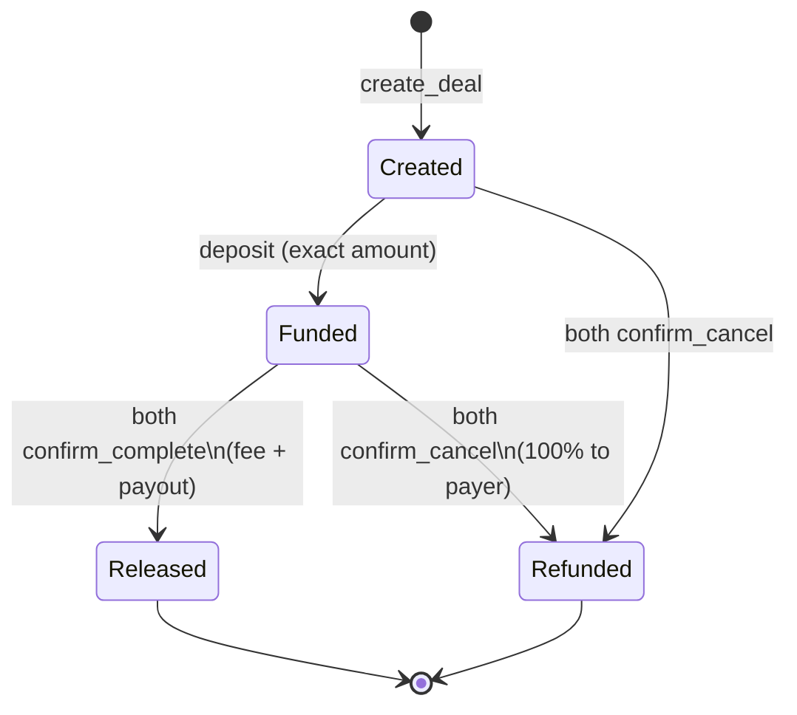

# Contractor (experimental archive)

> **Status: not in production.** Learning / open-source experiment only.  
> No mainnet launch, no fee collection, no public marketing from this repo’s authors.

Non-custodial **native SOL escrow** sketch on Solana (Anchor): payer deposits into a deal PDA; funds release when **both** parties confirm complete; mutual cancel refunds the payer **100%**. Protocol fee (bps) is immutable after `initialize`.

## Do not use this for real money

- Smart contracts can have bugs.
- Dual-confirm with **no arbiter** can permanently lock funds if parties disagree.
- Non-custodial ≠ legal or regulatory clearance. Read [docs/LEGAL-RISK.md](docs/LEGAL-RISK.md).
- If you fork it, you are responsible for your own compliance and security.

## State machine



## Quickstart (devnet / local)

```bash
# Program
anchor build
anchor test

# Frontend (static / IPFS-ready)
cd app
cp .env.example .env   # leave fee recipient empty unless you know what you're doing
npm install
npm run dev
```

Default example fee in docs/tests: **600 bps (6%)**, max **1000 bps**. Fee only on successful release. Set `FEE_RECIPIENT` via environment — **never commit personal wallets**.

## Layout

| Path | Purpose |
|------|---------|
| `programs/contractor/` | Anchor program |
| `tests/` | Integration tests |
| `app/` | SvelteKit UI (`adapter-static`) |
| `docs/` | Architecture, deploy notes, legal-risk, sample marketing copy |

## Instructions

1. `initialize(fee_bps, fee_recipient)` — once; `1..=1000` bps; **no update ix**
2. `create_deal(deal_id, payee, amount, terms_hash)` — signer = payer = creator
3. `deposit` — exact amount; Created → Funded
4. `confirm_complete` — both → release
5. `confirm_cancel` — both Funded → full refund; both Created → close

## Security model (design intent)

- Deal PDA holds lamports; dual confirmation for release
- Config fee immutable after `initialize`
- Documented path: `solana program set-upgrade-authority … --final`, discard deployer key
- Exact deposit; status gates against double release

See [docs/ARCHITECTURE.md](docs/ARCHITECTURE.md).

## License

MIT — see `LICENSE`.
